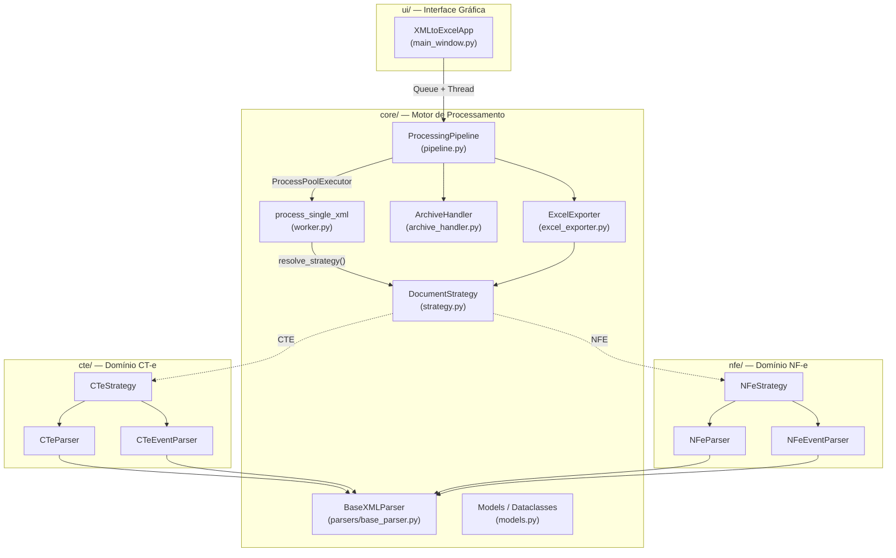
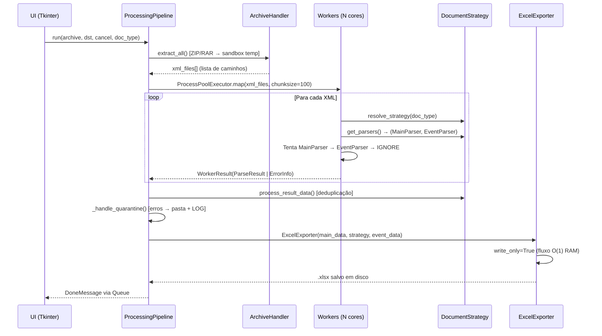

# 🏗️ ARCHITECTURE.md — Conversor XML para Excel (CT-e / NF-e)

> **Versão:** 0.2.0 · **Última atualização:** 2026-05-12  
> **Stack:** Python 3.10+ · Tkinter · openpyxl · xml.etree.ElementTree · PyInstaller

---

## 📑 Índice

1. [Visão Geral](#1-visão-geral)
2. [Estrutura de Diretórios (Package by Feature)](#2-estrutura-de-diretórios-package-by-feature)
3. [Diagrama de Arquitetura](#3-diagrama-de-arquitetura)
4. [Módulos e Responsabilidades](#4-módulos-e-responsabilidades)
5. [Design Patterns Utilizados](#5-design-patterns-utilizados)
6. [Fluxo de Dados (Pipeline)](#6-fluxo-de-dados-pipeline)
7. [Modelo de Processamento Paralelo](#7-modelo-de-processamento-paralelo)
8. [Estrutura de Exportação Excel](#8-estrutura-de-exportação-excel)
9. [CI/CD e Empacotamento](#9-cicd-e-empacotamento)
10. [Cobertura de Testes](#10-cobertura-de-testes)
11. [Code Review — Pontos Positivos](#11-code-review--pontos-positivos)
12. [Code Review — Pontos de Melhoria](#12-code-review--pontos-de-melhoria)

---

## 1. Visão Geral

O **Conversor XML para Excel** é uma ferramenta de automação fiscal que processa lotes massivos de arquivos XML do SEFAZ (CT-e e NF-e), extrai dados financeiros/fiscais de forma estruturada, normaliza nomenclaturas dinâmicas de transportadoras e exporta para planilhas Excel prontas para conciliação contábil.

**Métricas do Codebase:**

| Métrica                | Valor       |
|------------------------|-------------|
| Linhas de código (`.py`) | ~3.400    |
| Módulos Python         | 22 arquivos |
| Testes unitários       | 5 arquivos  |
| Dependências runtime   | 2 (`openpyxl`, `rarfile`) |
| CI/CD Workflows        | 2 (Tests + Build) |

---

## 2. Estrutura de Diretórios (Package by Feature)

O projeto segue a organização **Package by Feature**, onde cada domínio fiscal (CT-e, NF-e) é um módulo autocontido:

```
xmltoexcel-main/
├── main.py                          # Entry point (Tkinter + multiprocessing.freeze_support)
├── pyproject.toml                   # Configuração do projeto (uv/pip)
├── GEMINI.md                        # Regras de desenvolvimento
│
├── core/                            # 🔧 Infraestrutura compartilhada (agnóstica ao tipo fiscal)
│   ├── __init__.py
│   ├── models.py                    #   Dataclasses: ParseResult, WorkerResult, mensagens UI
│   ├── constants.py                 #   Constantes globais: headers CT-e, configs UI/Excel
│   ├── strategy.py                  #   ABC DocumentStrategy + resolve_strategy()
│   ├── pipeline.py                  #   ProcessingPipeline: orquestrador principal
│   ├── worker.py                    #   process_single_xml(): função de worker paralelo
│   ├── archive_handler.py           #   ArchiveHandler: extração ZIP/RAR recursiva + sandbox
│   ├── excel_exporter.py            #   ExcelExporter: exportação write_only O(1)
│   └── parsers/
│       └── base_parser.py           #   BaseXMLParser (ABC): busca hierárquica em XML
│
├── cte/                             # 📄 Domínio CT-e (Conhecimento de Transporte)
│   ├── __init__.py
│   ├── cte_parser.py                #   CTeParser + COMPONENTS_MAP (roteador inteligente)
│   ├── cte_event_parser.py          #   CTeEventParser (Cancelamento, CC-e, Desacordo)
│   └── cte_strategy.py              #   CTeStrategy: implementação de DocumentStrategy
│
├── nfe/                             # 📄 Domínio NF-e (Nota Fiscal Eletrônica)
│   ├── __init__.py
│   ├── nfe_constants.py             #   Headers, gray cols, accounting cols (154 colunas)
│   ├── nfe_parser.py                #   NFeParser: relação 1→N (1 XML → N linhas por item)
│   ├── nfe_event_parser.py          #   NFeEventParser (Cancelamento, CC-e)
│   └── nfe_strategy.py              #   NFeStrategy: implementação de DocumentStrategy
│
├── ui/                              # 🖥️ Interface Gráfica
│   ├── __init__.py
│   └── main_window.py               #   XMLtoExcelApp: Tkinter + polling de queue
│
├── tests/                           # 🧪 Testes Unitários
│   ├── conftest.py                  #   Fixtures XML in-memory (zero disco)
│   ├── core/
│   │   ├── test_models.py           #   Testes de dataclasses e enums
│   │   └── test_pipeline_dedup.py   #   Testes de deduplicação via Strategy
│   └── parsers/
│       ├── test_cte_parser.py       #   Testes do CTeParser (extração, ICMS, routing)
│       ├── test_cte_event_parser.py #   Testes do CTeEventParser
│       ├── test_nfe_parser.py       #   Testes do NFeParser
│       └── test_nfe_event_parser.py #   Testes do NFeEventParser
│
├── assets/
│   └── ico.ico                      # Ícone da aplicação
├── bin/
│   └── UnRAR.exe                    # Motor RAR embutido (portabilidade Windows)
└── .github/workflows/
    ├── tests.yml                    # CI: pytest + coverage (>80%)
    └── build-windows.yml            # CD: PyInstaller → .exe
```

---

## 3. Diagrama de Arquitetura



---

## 4. Módulos e Responsabilidades

### 4.1 `core/` — Infraestrutura Compartilhada

| Arquivo | Responsabilidade | LOC |
|---------|-----------------|-----|
| `models.py` | Dataclasses tipadas: `ParseResult`, `WorkerResult`, `ErrorInfo` e mensagens UI (`StatusMessage`, `DoneMessage`, etc.) | 59 |
| `constants.py` | Constantes globais: `EXCEL_HEADERS` (CT-e), `SKIP_COLS`, `EVENT_SHEET_HEADERS`, configs de UI e estilos Excel | 96 |
| `strategy.py` | ABC `DocumentStrategy` + factory `resolve_strategy()` para seleção dinâmica CTE/NFE | 70 |
| `pipeline.py` | `ProcessingPipeline`: orquestrador que coordena extração → parsing paralelo → quarentena → exportação Excel | 158 |
| `worker.py` | `process_single_xml()`: função top-level serializável para workers do `ProcessPoolExecutor` | 60 |
| `archive_handler.py` | `ArchiveHandler`: extração recursiva ZIP/RAR com sandbox temporário, proteção contra Zip Bomb (path traversal) e context manager | 123 |
| `excel_exporter.py` | `ExcelExporter`: exportação em modo `write_only=True` (O(1) RAM), formatação contábil e detecção de colunas dinâmicas | 145 |
| `parsers/base_parser.py` | ABC `BaseXMLParser`: busca hierárquica em 3 camadas (filhos diretos → XPath C → fallback iter) | 53 |

### 4.2 `cte/` — Domínio CT-e

| Arquivo | Responsabilidade | LOC |
|---------|-----------------|-----|
| `cte_parser.py` | `CTeParser`: extração de CT-e com `ICMS_MAP` para mapeamento polimórfico de impostos e `COMPONENTS_MAP` para roteamento inteligente de componentes de frete | 192 |
| `cte_event_parser.py` | `CTeEventParser`: parsing de eventos (Cancelamento, CC-e, EPEC, Desacordo) com `EVENT_MAP` SEFAZ | 71 |
| `cte_strategy.py` | `CTeStrategy`: implementação concreta de `DocumentStrategy` com deduplicação por `chv_cte_Id` | 77 |

### 4.3 `nfe/` — Domínio NF-e

| Arquivo | Responsabilidade | LOC |
|---------|-----------------|-----|
| `nfe_constants.py` | Headers (154 colunas), colunas separadoras (`NFE_GRAY_COLS`) e colunas monetárias (`NFE_ACCOUNTING_COLS`) | 262 |
| `nfe_parser.py` | `NFeParser`: flatten 1→N (1 XML gera N linhas, 1 por `<det>`), extração de ICMS/IPI/PIS/COFINS/ICMSUFDest | 250 |
| `nfe_event_parser.py` | `NFeEventParser`: parsing de eventos NF-e (Cancelamento, CC-e) | 67 |
| `nfe_strategy.py` | `NFeStrategy`: deduplicação por tupla `(chv_nfe_Id, nItem_nItem)` | 77 |

### 4.4 `ui/` — Interface Gráfica

| Arquivo | Responsabilidade | LOC |
|---------|-----------------|-----|
| `main_window.py` | `XMLtoExcelApp`: UI Tkinter com input híbrido (arquivo/pasta), seletor CT-e/NF-e, barra de progresso, polling de `queue.Queue` e protocolo de fecho seguro | 274 |

---

## 5. Design Patterns Utilizados

| Pattern | Localização | Propósito |
|---------|-------------|-----------|
| **Strategy** | `core/strategy.py` → `cte/cte_strategy.py`, `nfe/nfe_strategy.py` | Isolar regras de parsing, headers, deduplicação e formatação por tipo de documento fiscal |
| **Template Method** | `core/parsers/base_parser.py` | `BaseXMLParser` define o esqueleto de busca em XML; subclasses implementam `extract_data()` |
| **Factory Method** | `resolve_strategy()` em `core/strategy.py` | Instancia a estratégia correta a partir de uma string `doc_type` |
| **Pipeline** | `core/pipeline.py` | Orquestração sequencial de fases: extração → parsing → quarentena → exportação |
| **Producer-Consumer** | `ui/main_window.py` ↔ `core/pipeline.py` | UI (consumer) consome mensagens via `queue.Queue`; pipeline (producer) as emite em background |
| **Context Manager** | `core/archive_handler.py` | `ArchiveHandler` garante cleanup do diretório temporário via `__enter__`/`__exit__` |
| **Data Transfer Object** | `core/models.py` | Dataclasses imutáveis para transporte de dados entre camadas |

---

## 6. Fluxo de Dados (Pipeline)



---

## 7. Modelo de Processamento Paralelo

```
┌─────────────────────────────────────────────────┐
│              ProcessingPipeline                  │
│                                                  │
│  max_workers = max(1, cpu_count() - 1)          │
│  chunksize = 100 (minimiza overhead IPC)         │
│                                                  │
│  ┌─────────┐ ┌─────────┐ ┌─────────┐           │
│  │Worker 1 │ │Worker 2 │ │Worker N │  ← Processos │
│  │ parse() │ │ parse() │ │ parse() │           │
│  └────┬────┘ └────┬────┘ └────┬────┘           │
│       │           │           │                  │
│       └───────────┴───────────┘                  │
│                   │                              │
│           ┌───────▼────────┐                     │
│           │  Deduplicação  │  ← Thread principal │
│           │  (Set in-mem)  │                     │
│           └───────┬────────┘                     │
│                   │                              │
│           ┌───────▼────────┐                     │
│           │ ExcelExporter  │  ← write_only=True  │
│           │   (O(1) RAM)   │                     │
│           └────────────────┘                     │
└─────────────────────────────────────────────────┘
```

**Decisões-chave:**
- `ProcessPoolExecutor` (não `ThreadPoolExecutor`) para bypass do GIL em parsing XML CPU-bound
- `chunksize=100` reduz overhead de serialização IPC
- `functools.partial` torna `process_single_xml` compatível com `executor.map`
- `cancel_event` (`threading.Event`) permite cancelamento cooperativo sem matar processos

---

## 8. Estrutura de Exportação Excel

### Aba Principal (CTe Data / NF-e Data)

| Aspecto | Implementação |
|---------|---------------|
| **Modo** | `write_only=True` — streaming direto para disco |
| **Colunas fixas** | `EXCEL_HEADERS` (CT-e: 63 cols) ou `NFE_HEADERS` (NF-e: 154 cols) |
| **Colunas dinâmicas** | `comp_*` — detectadas em runtime, ordenadas e anexadas ao final |
| **Formato datas** | `DD/MM/YYYY HH:mm:SS` (conversão via `datetime.fromisoformat`) |
| **Formato monetário** | `#,##0.00` para colunas em `accounting_cols` e `comp_*` |
| **Separadores visuais** | Colunas com `()` (CT-e) ou `NFE_GRAY_COLS` (NF-e) recebem fundo cinza `#D3D3D3` |

### Aba de Eventos

| Coluna | Conteúdo |
|--------|----------|
| Chave de Acesso (Referência) | 44 dígitos |
| Tipo de Evento | Cancelamento, CC-e, EPEC, Desacordo |
| Data do Evento | ISO 8601 |
| Detalhes / Justificativa | Texto livre ou `[grupo \| campo -> valor]` |

---

## 9. CI/CD e Empacotamento

### `tests.yml` — Pipeline de Testes
- **Trigger:** Push em `main`, `feature/*`, `fix/*` e PRs
- **Runner:** `windows-latest`
- **Python:** 3.14
- **Comando:** `uv run pytest -v --tb=short --cov-fail-under=80`
- **Cobertura mínima:** 80%

### `build-windows.yml` — Build do Executável
- **Trigger:** Push em `main`, tags `v*.*.*`, manual
- **Runner:** `windows-latest`
- **Python:** 3.10
- **PyInstaller:** `--onefile --windowed` com `UnRAR.exe` e `ico.ico` embutidos
- **Artefato:** `EXE-Windows` (retenção: 14 dias)

---

## 10. Cobertura de Testes

| Arquivo de Teste | Módulo Coberto | Cenários |
|-----------------|----------------|----------|
| `test_models.py` | `core/models.py` | DataType enum, ParseResult, WorkerResult, ErrorInfo, mensagens UI |
| `test_pipeline_dedup.py` | `cte/cte_strategy.py`, `nfe/nfe_strategy.py` | Deduplicação CTE por chave, NF-e por (chave, nItem), chave vazia, eventos |
| `test_cte_parser.py` | `cte/cte_parser.py` | Estrutura, chave de acesso, campos base, NF-e keys, ICMS mapping (00, 60, OutraUF), routing de componentes, soma acumulativa, fallback dinâmico, normalização |
| `test_cte_event_parser.py` | `cte/cte_event_parser.py` | Cancelamento, CC-e com infCorrecao, Desacordo, código desconhecido |
| `test_nfe_parser.py` | `nfe/nfe_parser.py` | Estrutura, flatten 1→N, campos de produto e impostos |
| `test_nfe_event_parser.py` | `nfe/nfe_event_parser.py` | Cancelamento, CC-e com xCorrecao |

**Fixtures:** Todos os XMLs são criados in-memory via `ET.fromstring()` — zero acesso a disco nos testes.

---

## 11. Code Review — Pontos Positivos

### ✅ Arquitetura

- **Package by Feature** bem aplicado: `cte/`, `nfe/` e `core/` são módulos coesos e isolados
- **Strategy Pattern** permite adicionar novos tipos de documento (ex: MDF-e) sem modificar o pipeline
- **Separação clara** entre infraestrutura (`core/`) e domínio fiscal (`cte/`, `nfe/`)
- **Baixo acoplamento** — módulos comunicam via abstrações (`DocumentStrategy`, `BaseXMLParser`)

### ✅ Performance e Resiliência

- `ProcessPoolExecutor` com `chunksize=100` — excelente para lotes de +50k XMLs
- `openpyxl write_only=True` — previne OOM em exportações gigantes
- Quarentena de erros com traceback — XMLs corrompidos não interrompem o lote
- Proteção contra Zip Bomb (path traversal) no `ArchiveHandler`
- Cancelamento cooperativo via `threading.Event`

### ✅ Qualidade de Código

- Tipagem forte com `dataclasses`, `Enum`, e type hints em todas as assinaturas
- Testes unitários com fixtures XML in-memory (rápidos e sem side effects)
- Logging estruturado (`logging.getLogger(__name__)`) em todos os módulos
- Context manager no `ArchiveHandler` para cleanup garantido
- `COMPONENTS_MAP` como roteador de sinônimos — extensível sem alterar lógica

### ✅ DevOps

- CI com cobertura mínima de 80%
- Build automatizado via GitHub Actions com artefatos para download
- Portabilidade: `UnRAR.exe` embutido, ícone embutido, `freeze_support()`

---

## 12. Code Review — Pontos de Melhoria

### 🔶 Média Prioridade

#### 12.1 — `resolve_strategy()` reconstrói a estratégia em cada worker

**Arquivo:** `core/worker.py:28`

Cada chamada a `process_single_xml` invoca `resolve_strategy()`, que instancia uma nova `CTeStrategy` ou `NFeStrategy`. Em lotes de 50k XMLs, isso cria 50k objetos descartáveis.

**Recomendação:** A estratégia já é resolvida uma vez no `pipeline.py`. Considerar passar os parsers diretamente para o worker (via `functools.partial`) em vez do `doc_type` string, evitando a resolução redundante. Nota: como os workers rodam em processos separados, um cache por processo (`lru_cache`) também resolveria.

#### 12.2 — Busca em 3 camadas no `BaseXMLParser._search_tag` pode ser redundante

**Arquivo:** `core/parsers/base_parser.py:22-47`

O método executa 3 estratégias sequenciais: filhos diretos → XPath `{*}` → fallback `iter()`. A terceira camada (fallback `iter()`) percorre **toda** a árvore e pode mascarar bugs ao encontrar tags em profundidade inesperada.

**Recomendação:** Avaliar se a 3ª camada é realmente necessária na prática. Se for, adicionar logging para rastrear quando ela é ativada e considerar torná-la opt-in.

#### 12.3 — `NFeParser` com 250 linhas se aproxima do limite de "God Class"

**Arquivo:** `nfe/nfe_parser.py`

O parser contém 9 métodos privados para extração de impostos (`_extract_icms`, `_extract_ipi`, `_extract_pis`, `_extract_cofins`, `_extract_icms_uf_dest`, `_fill_imposto_empty`). Embora bem segmentados, a classe concentra toda a lógica.

**Recomendação:** Considerar extrair um `NFeImpostoExtractor` dedicado, mantendo o `NFeParser` focado no flatten 1→N e delegando a extração de impostos.

#### 12.4 — Headers de CT-e em `core/constants.py` viola o isolamento por feature

**Arquivo:** `core/constants.py:10-63`

`EXCEL_HEADERS` e `SKIP_COLS` são específicos de CT-e mas vivem em `core/`. O módulo `nfe/` já faz correto, com `nfe_constants.py` dentro do próprio domínio.

**Recomendação:** Mover `EXCEL_HEADERS` e `SKIP_COLS` para um novo `cte/cte_constants.py` para manter a simetria com o módulo `nfe/`.

#### 12.5 — Duplicação de lógica entre `CTeEventParser` e `NFeEventParser`

Os dois parsers de eventos têm estrutura quase idêntica (busca `infEvento`, extrai `tpEvento`, `dhEvento`, `xJust`). A diferença é: tag raiz (`eventoCTe` vs `evento`) e campo de chave (`chCTe` vs `chNFe`).

**Recomendação:** Extrair uma classe base `BaseEventParser(BaseXMLParser)` que receba `root_tag`, `key_tag` e `event_map` como parâmetros, eliminando ~50 linhas de código duplicado.

### 🟢 Baixa Prioridade

#### 12.6 — `_fill_imposto_empty` usa lista hardcoded de 30 chaves

**Arquivo:** `nfe/nfe_parser.py:229-249`

Se os headers de impostos mudarem, esta lista precisa ser atualizada manualmente e pode sair de sincronia com `NFE_HEADERS`.

**Recomendação:** Gerar a lista automaticamente filtrando `NFE_HEADERS` por prefixo `imposto_`.

#### 12.7 — Inconsistência nos workflows de CI

**Arquivo:** `.github/workflows/tests.yml:21` vs `build-windows.yml:20`

O CI de testes usa Python **3.14**, enquanto o build usa Python **3.10**. Isso pode levar a falsos positivos: testes passam em 3.14 mas o `.exe` compilado em 3.10 falha.

**Recomendação:** Alinhar as versões ou adicionar matrix strategy testando em ambas.

#### 12.8 — `pyproject.toml` com dependências de dev duplicadas

**Arquivo:** `pyproject.toml:12-16` e `pyproject.toml:28-32`

`pytest` e `pytest-cov` aparecem em `[project.optional-dependencies].dev` **e** em `[dependency-groups].dev` com versões diferentes (pytest>=8.3 vs >=9.0.3).

**Recomendação:** Remover `[project.optional-dependencies].dev` e manter apenas `[dependency-groups].dev` (padrão `uv`).

#### 12.9 — Falta de tipagem no retorno de `get_parsers()`

**Arquivo:** `core/strategy.py:33`

O retorno `Tuple[type, type]` é genérico demais. Não garante em tempo de análise estática que os tipos retornados são subclasses de `BaseXMLParser`.

**Recomendação:** Usar `Tuple[Type[BaseXMLParser], Type[BaseXMLParser]]` com import de `Type` do `typing`.

#### 12.10 — `ExcelExporter` importa `resolve_strategy` sem usar

**Arquivo:** `core/excel_exporter.py:15`

O import `resolve_strategy` não é utilizado no arquivo.

**Recomendação:** Remover o import não utilizado.

---

> **Nota:** Nenhum dos pontos acima é um bug ou falha crítica. O codebase está bem estruturado, testado e pronto para produção. As sugestões visam manutenibilidade a longo prazo e aderência ainda maior aos princípios SOLID.
